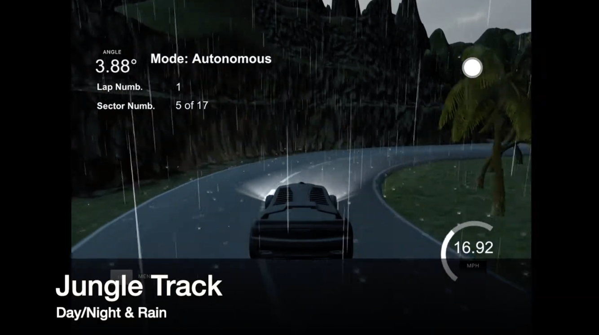
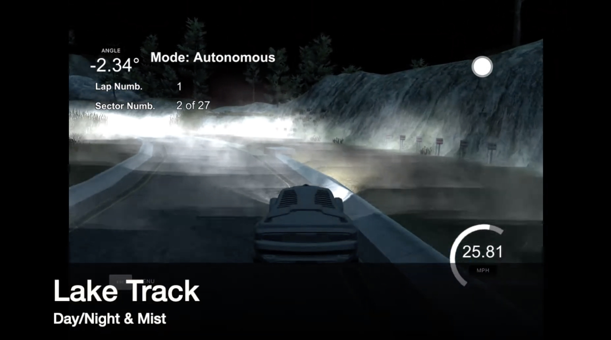
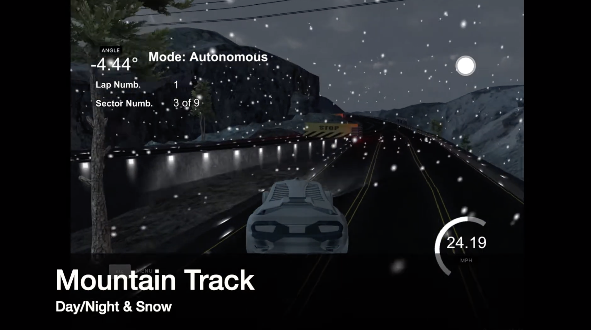

# Misbehaviour Prediction for Autonomous Driving Systems

This repository contains the code attached to the paper "Misbehaviour Prediction for Autonomous Driving Systems"
 by A. Stocco, M. Weiss, M. Calzana, P. Tonella, to be published in the proceedings of the 42nd International Conference in Software Engineering (ICSE 2020).

A preprint of the paper can be found on [arXiv](https://arxiv.org/abs/1910.04443).
## Dependencies

**Software setup:**
We adopted the [PyCharm](https://www.jetbrains.com/pycharm/) Professional 2019.3.1, a Python IDE by JetBrains.

If you have [anaconda](https://www.continuum.io/downloads) or [miniconda](https://conda.io/miniconda.html) 
installed on your machine, you can create and install all dependencies on a dedicated virtual environment, 
by running the following command:

```python
# Use TensorFlow with GPU
conda env create -f code-sdc/conda-env.yml
```

Alternatively you can manually install the required libraries (see the contents of the conda-env.yml files) using ```pip```.

**Hardware setup:** Training the DNN models (self-driving cars and anomaly detectors) on our datasets is computationally expensive. 
Therefore we recommend using a machine with GPU. 
In our setting, we ran our experiments on a machine equipped with a i9 processor, 32 GB of memory, and an Nvidia GPU GeForce RTX 2080 Ti with 11GB of dedicated memory. 

## Repository Structure

The repository is structured as follows:

<pre/>
- code-predictors
  | This folder contains all the code to run the training and evaluation of the misbehavior predictors.
- code-sdc
  | This folder contains all the code to train the self-driving car models and record them when they are driving.
</pre>

### Other Artefacts

We made the following artifacts available as a torrent [here](https://academictorrents.com/details/221c3c71ac0b09b1bb31698534d50168dc394cc7). The files have a combined size of 25 GB (compressed: 7.93 GB) , and the torrent contains:

<pre/>
- Trained SDC Models
  | Contains the weights of the trained self driving car models.
- Trained Failure Predictor Models
  | Contains the weights of the failure predictor models (i.e., the autoencoders and the deeproad pca).
- Training Dataset & Evaluation Dataset
  | These folders contain the datasets of images used for training and evaluation.
- Evaluation Results
  | This folders contains the sqlite databases containing the results of the evaluation.
</pre>

## Usage

### Reproduce the results

```python
python code-predictors/evaluation_runner.py
```

*Note:* You do not need the simulator to reproduce the results.

### Run the pretrained SDC models

Start up our Udacity self-driving simulator, choose a scene, and press the Autonomous Mode button. Then, run the model as follows:

```python
python code-sdc/drive.py <sdc-model>.h5
```

### Train a SDC model

You'll need the data folder which contains the training images.

```python
python code-sdc/train_self_driving_car.py
```

This will generate a file `model-<epoch>.h5` whenever the performance in the epoch is better than the previous best.  For example, the first epoch will generate a file called `model-000.h5`.


### Train an anomaly detector


You'll need the data folder which contains the training images.

```python
python code-predictors/training_runner.py
```

## Improved Udacity simulator

Our improved Udacity simulator is available as binary file for Windows and macOS platforms [here](https://drive.google.com/drive/folders/1i4naoN9Wermz5LSW_RNeXdN2zhDMKIDJ). 

### Screenshots and video of the simulator
*Note:* Click on the screenshot images to watch a demo video.

<a href="https://youtu.be/r4oiX6UBJPI"></img></a>

<a href="https://youtu.be/r4oiX6UBJPI"></img></a>

<a href="https://youtu.be/r4oiX6UBJPI"></img></a>

<a href="https://youtu.be/r4oiX6UBJPI"></img></a>

## Reference

If you use our work in your research, or it helps it, or if you simply like it, please cite SelfOracle in your publications. 
Here is an example BibTeX entry:

```
@inproceedings{2020-icse-misbehaviour-prediction,
	title= {Misbehaviour Prediction for Autonomous Driving Systems},
	author= {Andrea Stocco and Michael Weiss and Marco Calzana and Paolo Tonella},
	booktitle= {Proceedings of 42nd International Conference on Software Engineering},
	series= {ICSE '20},
	publisher= {ACM},
	pages= {12 pages},
	year= {2020}
}
```

## License 
MIT. See the [LICENSE.md](https://github.com/testingautomated-usi/selforacle/blob/master/LICENSE.md) file.

## Contacts

For any questions, feel free to contact Andrea Stocco ([andrea.stocco@usi.ch](mailto:andrea.stocco@usi.ch)) 
or Michael Weiss ([michael.weiss@usi.ch](mailto:michael.weiss@usi.ch)).
